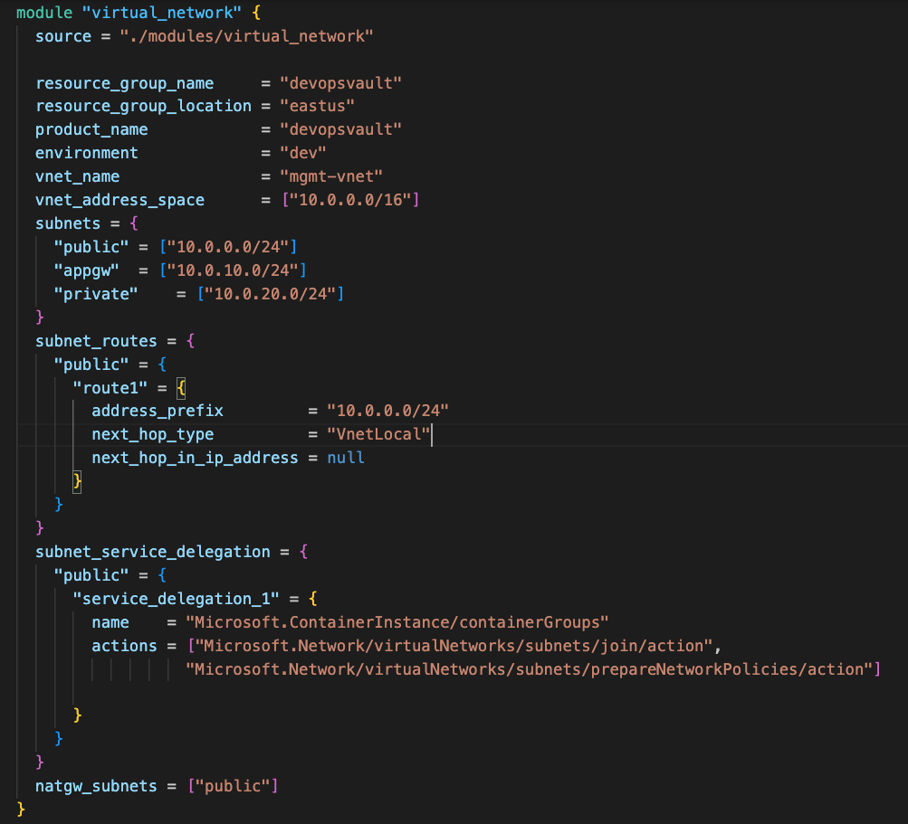

# Azure Terraform Modules Repository

This Terraform module deploys a Virtual Network in Azure with a subnet or subnets, route tables and nat gateways passed in as input parameters

The module does not create nor expose a security group as of now. This would need to be defined separately as additional security rules on subnets in the deployed network.

## Notice to contributor
This module contains resources with for_each meta-argument, and using count directly on the module will cause an overlap.

## Example Usage

## Authors
Originally created by Victor Ekeleme

## License
Apache License 2.0

## Requirements

| Name     |     Version     |
|----------|-----------------|
| terraform |  >= 1.7.0      |
| azurerm   |    ~> 3.80     |

## Providers

| Name     |     Version     |
|----------|-----------------|
| azurerm   |    ~> 3.80     |

## Resources

| Name                         | Type      |
|------------------------------|-----------|
| azurerm_virtual_network.this | Resource   |
| azurerm_subnet.this          | Resource   |
| azurerm_route_table.this     | Resource   |
| azurerm_subnet_route_table_association.this | Resource   |
| azurerm_nat_gateway.this | Resource   |
| azurerm_subnet_nat_gateway_association.this | Resource   |

|Name                     |   Description| Type     |
|-------------------------|--------------|----------|
resource_group_name       |              | string  |
resource_group_location   |              | string  |
product_name              |              | string|
environment               |              |  string    |
vnet_name                 |              | string  |
vnet_address_space        |              |list(string)|
subnet_routes             |              | map(map(object({ address_prefix=string, next_hop_type=string,next_hop_in_ip_address=string}))) |
subnet_service_delegation |              |    map(map(object({name=string, actions = list(string)})))|
natgw_subnets             |              |   list(string)|

<!-- |Name                     |   Description| Type     |
|-------------------------|--------------|----------|
resource_group_name       |              |     String     |
resource_group_location   |              |          |
product_name              |              |          |
environment               |              |          |
vnet_name                 |              |          |
vnet_address_space        |              |          |
subnet_routes             |              |          |
subnet_service_delegation |              |          |
natgw_subnets             |              |          | -->